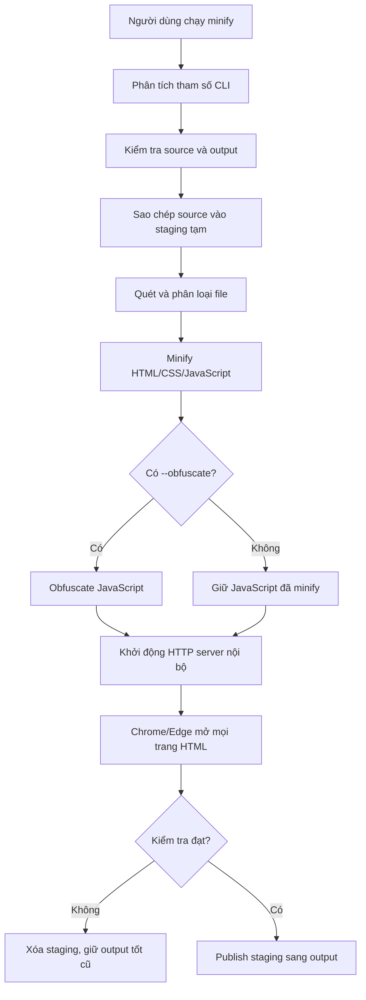

# Tài liệu kỹ thuật Content Minify CLI

Tài liệu này giải thích công nghệ, cấu trúc code và luồng hoạt động của
`content-minify-cli` phiên bản 0.4.0. Mục tiêu là giúp người đọc có thể tự xem,
debug, bảo trì và mở rộng tool.

## 1. Tool giải quyết việc gì?

Tool nhận một thư mục static web content, sao chép nó sang thư mục đầu ra rồi xử
lý HTML, CSS và JavaScript. Thư mục nguồn không bị sửa.

Tool có hai mức:

| Lệnh | HTML | CSS | JavaScript |
| --- | --- | --- | --- |
| `minify.cmd CONTENT_01` | Minify | Minify | Minify |
| `minify.cmd CONTENT_01 --obfuscate` | Minify | Minify | Minify rồi obfuscate |

- **Minification** loại bỏ comment, khoảng trắng và tối ưu biểu thức để giảm
  dung lượng. Một số biến cục bộ có thể được rút ngắn.
- **Obfuscation** biến đổi JavaScript có chủ đích để con người khó đọc và khó
  reverse engineer hơn.

Obfuscation không phải mã hóa tuyệt đối. Trình duyệt vẫn phải nhận được code có
thể thực thi, vì vậy người có đủ thời gian và kỹ năng vẫn có thể phân tích nó.

## 2. Công nghệ sử dụng

Tool chạy trên Node.js 20 trở lên và dùng ES Modules.

| Công nghệ/thư viện | Vai trò trong tool |
| --- | --- |
| Node.js | Chạy CLI, đọc/ghi file, tạo HTTP server và quản lý thư mục |
| `terser` | Parse, compress và mangle JavaScript |
| `clean-css` | Minify và tối ưu CSS |
| `html-minifier-terser` | Minify cấu trúc HTML và CSS inline |
| `javascript-obfuscator` | Làm rối JavaScript khi có `--obfuscate` |
| `playwright-core` | Điều khiển Chrome/Edge để kiểm tra bản kết quả |
| `node:test` | Chạy automated tests của CLI |

Phiên bản dependency được khóa chính xác trong `package.json` và
`package-lock.json`. Việc khóa phiên bản giúp hai máy cài cùng một phiên bản
tool nhận được cùng bộ thư viện, giảm rủi ro hành vi thay đổi bất ngờ.

## 3. Cấu trúc repository

```text
content-minify-cli/
├─ bin/
│  └─ minify.js              Điểm bắt đầu của câu lệnh terminal
├─ lib/
│  ├─ protect-content.js     Minify/obfuscate HTML, CSS và JavaScript
│  └─ verify-content.js      Kiểm tra output bằng Chrome/Edge
├─ test/
│  └─ cli.test.js            Integration tests qua giao diện CLI
├─ package.json              Metadata, dependency và đăng ký lệnh minify
├─ package-lock.json         Khóa toàn bộ dependency tree
├─ README.md                 Tài liệu tổng quan
└─ HUONG-DAN-SU-DUNG.md      Hướng dẫn cho người sử dụng
```

`minify.verify.json` không bắt buộc và thường nằm cạnh các thư mục content,
không nằm trong source code của package.

## 4. Luồng chạy tổng thể



Điểm quan trọng là tool không xử lý trực tiếp thư mục nguồn và cũng không thay
output tốt cũ trước khi bản mới vượt qua kiểm tra.

## 5. Tại sao gõ được lệnh `minify.cmd`?

Trong `package.json` có cấu hình:

```json
{
  "bin": {
    "minify": "./bin/minify.js"
  }
}
```

Khi chạy `npm install -g` hoặc `npm link`, npm tạo lệnh global tên `minify` và
trỏ lệnh đó đến `bin/minify.js`. Trên Windows, npm tạo thêm file shim
`minify.cmd`.

Dòng đầu trong `bin/minify.js` là:

```javascript
#!/usr/bin/env node
```

Dòng này cho hệ điều hành/npm biết file cần được chạy bằng Node.js.

## 6. File `bin/minify.js`: lớp điều phối CLI

Đây là entry point. File này không tự minify code mà điều phối toàn bộ quy trình.

### 6.1. `parseArguments(args)`

Hàm đọc các tham số terminal:

- Một hoặc nhiều tên content, ví dụ `CONTENT_01 C02`.
- `--obfuscate` để bật mức làm rối JavaScript.
- `--out <directory>` để chọn output khi chỉ xử lý một content.
- `--dry-run` để chỉ xem kế hoạch.
- `--help` và `--version`.

Option không hỗ trợ hoặc tham số thừa làm CLI dừng với exit code 1. Điều này
giúp tránh trường hợp người dùng gõ sai nhưng tưởng tool đã chạy đúng.

### 6.2. Xác định source và output

Các đường dẫn được chuyển thành absolute path bằng `path.resolve()`:

```text
source: <thư mục terminal>\CONTENT_01
output: <thư mục terminal>\dist\CONTENT_01
```

CLI từ chối chạy nếu:

- Source không tồn tại hoặc không phải thư mục.
- Output trùng source.
- Output nằm trong source.
- Source nằm trong output.
- Nhiều source có cùng basename và cùng trỏ tới một output trong `dist`.
- Dùng `--out` cùng lúc với nhiều content.

Các kiểm tra này bảo vệ thư mục gốc và tránh vòng lặp sao chép.

### 6.3. Staging directory

Tool tạo một thư mục tạm có dạng:

```text
dist\.CONTENT_01.stage-xxxxxx
```

Sau đó tool:

1. Sao chép toàn bộ source vào staging.
2. Minify/obfuscate các file trong staging.
3. Kiểm tra staging bằng browser.
4. Chỉ khi thành công mới publish staging thành output thật.

Nếu bất kỳ bước nào lỗi, staging bị xóa và output tốt trước đó vẫn được giữ.
Khi nhận nhiều content, CLI lặp pipeline này theo thứ tự. Tính atomic áp dụng cho
từng content; content đã publish trước một content lỗi sẽ không bị rollback.

### 6.4. `publish(staging, output)`

Đây là cơ chế publish an toàn:

- Output cũ được đổi tên thành một bản backup tạm.
- Staging được đổi tên thành output mới.
- Khi publish thành công, backup bị xóa.
- Khi publish thất bại, tool rollback output cũ.

Windows đôi khi không cho đổi tên thư mục đang được process khác giữ. Tool có
nhánh fallback dùng `syncDirectory()` để đồng bộ file, đồng thời vẫn tạo backup
và rollback nếu việc đồng bộ thất bại.

## 7. File `lib/protect-content.js`: lớp biến đổi nội dung

Module này export hai public function:

```javascript
inspectContent(root)
protectContent(outputRoot, { obfuscate })
```

### 7.1. Quét và phân loại file

`listFiles()` dùng `readdir(..., { recursive: true })` để lấy tất cả file trong
mọi thư mục con. `classifyFiles()` chia chúng thành:

- File `.html`.
- File `.css`, trừ `.min.css`.
- File `.js`, trừ `.min.js`.

File đã có hậu tố `.min.js` hoặc `.min.css` được giữ nguyên vì thường là thư
viện bên thứ ba đã được build sẵn. Minify/obfuscate lại các file này có thể tăng
rủi ro lỗi mà không đem lại nhiều lợi ích.

### 7.2. Minify JavaScript bằng Terser

Mọi JavaScript tự viết trước tiên đi qua Terser:

```javascript
const minified = await minifyJavaScript(source, {
  compress: { passes: 2 },
  ecma: 2015,
  mangle: { toplevel: false },
  module,
  safari10: true,
  toplevel: false,
});
```

Ý nghĩa các option chính:

- `compress.passes: 2`: Terser chạy tối ưu hai lượt.
- `mangle`: rút ngắn tên biến cục bộ.
- `toplevel: false`: không tùy tiện đổi tên/xóa các global có thể được file khác
  gọi đến.
- `module`: bật khi JavaScript nằm trong `<script type="module">`.
- `safari10: true`: tránh một số biến đổi từng gây lỗi trên Safari cũ.

Việc giữ global name là quyết định tương thích. Làm rối global mạnh hơn có thể
che code tốt hơn nhưng dễ phá các content cũ có nhiều file JavaScript gọi hàm
của nhau qua `window` hoặc global scope.

### 7.3. Obfuscate JavaScript

Khi `obfuscate` là `false`, hàm trả ngay code từ Terser. Khi là `true`, code đã
minify được chuyển tiếp sang `javascript-obfuscator`.

Một số option đáng chú ý:

- `identifierNamesGenerator: "hexadecimal"`: tạo tên kiểu `_0x...`.
- `stringArray: true`: chuyển nhiều chuỗi sang một mảng trung gian.
- `stringArrayEncoding: ["base64"]`: encode các chuỗi trong mảng.
- `splitStrings: true`: chia chuỗi thành nhiều đoạn.
- `transformObjectKeys: true`: biến đổi một số object key.
- `renameGlobals: false`: giữ tên global để giảm nguy cơ hỏng content.
- `controlFlowFlattening: false`: không làm phẳng control flow vì biến đổi này
  nặng và có nguy cơ tăng dung lượng/thời gian chạy.
- `deadCodeInjection: false`: không chèn code chết để tránh phình file.
- `selfDefending: false` và `debugProtection: false`: tránh các kỹ thuật bảo vệ
  mạnh có thể làm content khó debug hoặc không tương thích môi trường chạy.

Cấu hình hiện tại ưu tiên cân bằng giữa khó đọc và giữ chức năng, không chọn mức
obfuscation cực đoan.

### 7.4. Minify CSS bằng CleanCSS

CSS được xử lý như sau:

```javascript
new CleanCSS({ level: 2 }).minify(source)
```

`level: 2` cho phép tối ưu cả trong từng rule và giữa các rule. Nếu CleanCSS trả
về lỗi, tool dừng và không publish bản kết quả.

### 7.5. Minify HTML

Trước khi minify HTML, tool tìm JavaScript inline trong thẻ `<script>`:

- Thẻ có `src` được bỏ qua vì file JavaScript bên ngoài đã được xử lý riêng.
- `type="module"` được xử lý ở chế độ ES module.
- JSON/import map và các loại script không phải JavaScript được giữ nguyên.
- JavaScript inline được đưa qua cùng pipeline Terser/obfuscator.

Sau đó `html-minifier-terser` xử lý HTML với các option như:

- Thu gọn whitespace.
- Xóa comment.
- Minify CSS inline.
- Giữ closing slash cần thiết.
- Không xóa redundant attribute quá mạnh để ưu tiên tương thích.

`minifyJS` của `html-minifier-terser` được đặt `false` vì JavaScript inline đã
được xử lý trước. Nhờ đó code không bị minify hai lần và tool có thể nhận biết
`type="module"` cũng như áp dụng `--obfuscate` nhất quán.

## 8. File `lib/verify-content.js`: lớp kiểm tra chức năng

Minify thành công về cú pháp chưa đảm bảo content chạy đúng. Module này mở bản
kết quả bằng browser thật trước khi publish.

### 8.1. Tìm Chrome hoặc Edge

`findBrowser()` thử theo thứ tự:

1. Biến môi trường `MINIFY_BROWSER_PATH`.
2. Các vị trí cài Chrome phổ biến trên Windows.
3. Các vị trí cài Edge phổ biến trên Windows.

Tool dùng `playwright-core`, không tự tải Chromium riêng. Cách này giảm kích
thước package và tận dụng browser đã cài trên máy.

### 8.2. HTTP server nội bộ

`startServer()` tạo server chỉ lắng nghe trên `127.0.0.1` và một port ngẫu nhiên.
Browser vì vậy mở content qua HTTP thay vì `file://`.

Việc này quan trọng cho:

- ES modules.
- Đường dẫn root-relative như `/js/app.js`.
- Kiểm tra HTTP status và asset bị thiếu.

`safeAssetPath()` bảo vệ server khỏi request đi ra ngoài thư mục staging. Request
đáng ngờ bị trả HTTP 403.

### 8.3. Kiểm tra tất cả trang HTML

`listHtmlPages()` tìm mọi file HTML, ưu tiên `index.html` trước. Mỗi trang được
mở trong một browser page riêng.

Tool ghi nhận các lỗi:

- JavaScript runtime error (`pageerror`).
- `console.error`.
- Request asset thất bại.
- Response HTTP từ 400 trở lên.
- Trang load quá thời gian cho phép.

Chỉ cần một trang lỗi, toàn bộ quá trình publish bị hủy.

### 8.4. Smoke checks tùy chỉnh

File `minify.verify.json` cho phép mô tả các thao tác quan trọng của content:

```json
{
  "CONTENT_01": [
    { "action": "click", "selector": "#btn-next" },
    { "action": "expectText", "selector": "#step", "equals": "2" }
  ]
}
```

Các action hiện có:

- `click`: click phần tử.
- `drag`: kéo phần tử theo `dx`, `dy`.
- `wait`: chờ tối đa 30 giây.
- `expectText`: so sánh text chính xác.
- `expectAttribute`: kiểm tra attribute bằng `equals` hoặc `notEquals`.

Thuộc tính `page` có thể chỉ định trang HTML. Nếu không có, check chạy trên
`index.html`.

## 9. Vì sao tool giữ nguyên tên file?

Tool không tạo bundle và không viết import mới. Nó thực hiện:

1. `cp()` toàn bộ cây thư mục sang staging.
2. Đọc nội dung từng file cần xử lý.
3. Ghi nội dung mới trở lại đúng `filePath` đó.

Không có đoạn code nào sinh tên hash hoặc đổi tên asset. Vì vậy đường dẫn như:

```text
js/index.js
css/main.css
images/icon.png
```

vẫn giữ nguyên trong output.

## 10. Automated tests

`test/cli.test.js` là integration test. Test chạy chính file `bin/minify.js` bằng
child process, giống cách người dùng chạy terminal, thay vì gọi các hàm private.

Bộ test kiểm tra các hành vi chính:

- Minification mặc định không bật obfuscation.
- `--obfuscate` thực sự làm rối JavaScript.
- Một lệnh có thể xử lý nhiều content và tạo đúng các output riêng.
- Batch có output trùng nhau hoặc dùng `--out` mơ hồ bị từ chối.
- Giữ nguyên mọi tên file và đường dẫn.
- Không sửa thư mục nguồn.
- JavaScript inline và ES modules vẫn chạy.
- Kiểm tra các trang HTML phụ.
- Runtime error ngăn publish.
- Smoke check thất bại ngăn publish.
- Output tốt trước đó được giữ khi lần build mới lỗi.
- `--out`, `--dry-run`, `--help` và `--version` hoạt động.

Chạy test:

```powershell
cd content-minify-cli
npm.cmd test
```

## 11. Cách đọc và debug code

### Chạy trực tiếp source code, không cần cài global

```powershell
node .\bin\minify.js CONTENT_01
node .\bin\minify.js CONTENT_01 --obfuscate
node .\bin\minify.js CONTENT_01 C02 --obfuscate
```

Lưu ý: terminal phải đứng ở thư mục cha của `CONTENT_01`. Nếu đang đứng trong
repository của tool nhưng content nằm bên ngoài, có thể truyền đường dẫn tương
đối hoặc absolute path.

### Chỉ xem tool sẽ xử lý bao nhiêu file

```powershell
minify.cmd CONTENT_01 --dry-run
```

### Chọn browser cụ thể

```powershell
$env:MINIFY_BROWSER_PATH = "C:\Program Files\Google\Chrome\Application\chrome.exe"
minify.cmd CONTENT_01
```

### Đọc lỗi

Lỗi CLI được ghi vào stderr với tiền tố:

```text
minify: <nội dung lỗi>
```

Exit code khác 0 nghĩa là không nên sử dụng bản output mới.

## 12. Cách mở rộng tool

### Thêm một option CLI

1. Đọc option trong `parseArguments()`.
2. Hiển thị option trong `printHelp()`.
3. Truyền giá trị từ `main()` xuống module cần dùng.
4. Viết integration test chạy option qua terminal.
5. Cập nhật README, hướng dẫn và changelog.

### Thêm một loại smoke check

1. Thêm một `case` trong `runInteractionCheck()`.
2. Validate đầy đủ dữ liệu đầu vào.
3. Dùng Playwright locator/page API.
4. Thêm test chứng minh check thành công.
5. Thêm test chứng minh check thất bại ngăn publish.

### Thêm một loại file cần xử lý

1. Bổ sung cách nhận diện trong `classifyFiles()`.
2. Chọn thư viện parser/minifier chuyên dụng cho định dạng đó.
3. Không đổi tên hoặc đường dẫn file.
4. Bảo đảm lỗi thư viện làm dừng publish.
5. Thêm fixture và integration test.

Không nên tự viết thuật toán minify cho một ngôn ngữ phức tạp nếu đã có thư
viện parser/minifier ổn định. Phần code riêng của tool nên tập trung vào điều
phối, bảo vệ dữ liệu, kiểm tra và tương thích dự án.

## 13. Quy trình cập nhật dependency an toàn

Không nên cập nhật hàng loạt dependency rồi phát hành ngay. Quy trình đề xuất:

```powershell
cd content-minify-cli
npm.cmd outdated
npm.cmd audit
npm.cmd test
npm.cmd pack --dry-run
```

Sau khi cập nhật một thư viện:

1. Đọc changelog của thư viện đó.
2. Cập nhật từng thư viện hoặc từng nhóm nhỏ.
3. Chạy toàn bộ automated tests.
4. Chạy cả hai chế độ trên content thực tế.
5. So sánh danh sách file source/output.
6. Kiểm tra thủ công các thao tác quan trọng trước khi tạo tag phát hành.

## 14. Các giới hạn cần biết

- Obfuscation chỉ tăng chi phí đọc/reverse engineering, không bảo vệ được secret.
- Không được đặt password, API key hoặc private key trong JavaScript trình duyệt.
- Tool bỏ qua `.min.js` và `.min.css`; code bên trong các file đó không được
  obfuscate lại.
- `renameGlobals: false` ưu tiên tương thích nên một số tên global vẫn đọc được.
- Tool hiện tập trung vào `.html`, `.css` và `.js`; `.mjs`, TypeScript và source
  map chưa có pipeline riêng.
- Việc nhận diện JavaScript inline có logic riêng quanh thẻ `<script>`; content
  dùng template syntax hoặc HTML không chuẩn nên có test thực tế riêng.
- Browser verification phát hiện lỗi load/runtime và các smoke check đã cấu
  hình, nhưng không thể tự biết toàn bộ nghiệp vụ nếu không có check mô tả.
- Batch được xử lý tuần tự và atomic theo từng content, không atomic cho toàn bộ
  danh sách.

## 15. Tóm tắt trách nhiệm từng lớp

| Lớp | Trách nhiệm | Không nên làm |
| --- | --- | --- |
| `bin/minify.js` | CLI, path safety, staging, publish, rollback | Tự viết thuật toán minify |
| `lib/protect-content.js` | Gọi thư viện để biến đổi nội dung | Quản lý browser hoặc publish |
| `lib/verify-content.js` | Server tạm, browser và smoke checks | Sửa nội dung output |
| `test/cli.test.js` | Kiểm tra hành vi người dùng nhìn thấy | Phụ thuộc vào hàm private |

Hiểu ngắn gọn: code riêng của tool là lớp điều phối và an toàn; phần phân tích,
tối ưu và làm rối ngôn ngữ được giao cho các thư viện chuyên dụng.
